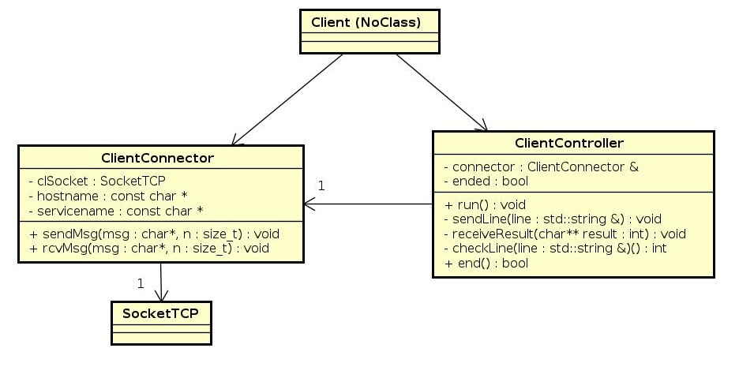

# 
 TP3 

# 
 Adivina el Número 

### 
 BOTTA, Guido Tomas 

### 
 Padron: 102103 

### 
 Enlace a Github: https://github.com/guidobotta/tp2-taller 

# Introducción

&nbsp;&nbsp;&nbsp;&nbsp; El presente trabajo práctico fue realizado con la finalidad de incorporar conceptos de manejo de servidores multi-clientes. Se debió unir conceptos de hilos y sockets.

&nbsp;&nbsp;&nbsp;&nbsp; Se desarrolló un juego en dos partes: una aplicación servidor y una aplicación cliente. La aplicación servidor soporta multiples clientes conectados en simultáneo.

# Desarrollo

## Consigna: Adivina el Número

&nbsp;&nbsp;&nbsp;&nbsp; El juego consiste en que un cliente debe adivinar un número de 3 cifras no repetidas generado por el servidor. El cliente tiene 10 intentos para adivinar. Para cada dígito, el servidor sumará se la siguiente forma:

- Si alguna cifra del número del cliente se encuentra en el número real, pero en otra posición, se contará como `1 regular`.
- Si alguna cifra del números del cliente se encuentra en el número real y en la posición correcta, se contará como `1 bien`.
- Si ninguna de las tres cifra del número del cliente se en encuentra en el número real, se contará como `3 mal`.

&nbsp;&nbsp;&nbsp;&nbsp; Una vez que el cliente ingrese un número, se envíara, con un cierto formato que se verá más adelante, al servidor. Este analizará si el número es válido (de 3 cifras sin repetir), la cantidad de dígitos bien, regular o mal, y le devolverá una respuesta al cliente.

&nbsp;&nbsp;&nbsp;&nbsp; Por ejemplo, suponiendo que el número real generado por el servidor es `135`, se puede dar el siguiente caso:

~~~
Cliente:~$ 489

//Cliente -> Servidor (envía intento)
//Servidor -> Cliente (envía respuesta)

Cliente:~$ 3 mal
Cliente:~$ 153

//Cliente -> Servidor (envía intento)
//Servidor -> Cliente (envía respuesta)

Cliente:~$ 1 bien, 2 regular
Cliente:~$ 135

//Cliente -> Servidor (envía intento)
//Servidor -> Cliente (envía respuesta)

Cliente:~$ Ganaste
~~~

&nbsp;&nbsp;&nbsp;&nbsp; El juego termina cuando el cliente adivine el número o cuando haya agotado sus 10 intentos.

## Ejecución, Entrada y Salida

### Servidor

&nbsp;&nbsp;&nbsp;&nbsp; El servidor debe ejecutarse de la siguiente manera:

~~~
./server <puerto> <numeros>
~~~

&nbsp;&nbsp;&nbsp;&nbsp; Donde numeros es un archivo de texto que contiene números. Por ejemplo:

~~~
153
456
129
~~~

&nbsp;&nbsp;&nbsp;&nbsp; Estos números deben ser procesador por la aplicación del servidor en forma de lista circular. Es decir, al primer cliente se le asignará el 153, al segundo el 456, al tercero el 129 y cuando ingrese un cuarto se volverá a asignar el 153.

&nbsp;&nbsp;&nbsp;&nbsp; Por entrada estándar, el servidor espera recibir una `q` cuando se desee cerrarlo. Al cerrar el servidor se esperará que se terminen todas las ejecuciones de los hilos.

&nbsp;&nbsp;&nbsp;&nbsp; Por salida estándar, el servidor imprimirá una lista de ganadores y perdedores al ser cerrado. El formato es el siguiente:

~~~
Estadísticas:
    Ganadores:  <cantidad de ganadores>
    Perdedores: <cantidad de perdedores>
~~~

&nbsp;&nbsp;&nbsp;&nbsp; Por la salida de error, el servidor imprimira los siguientes errores si es que ocurren:

- Si la cantidad de parámetros es inválida:

~~~
Error: argumentos inválidos
~~~

- Si alguno de los números de la lista que recibe por parámetro no se encuentra entre los valores 100 y 999:

~~~
Error: archivo con números fuera de rango
~~~

- Si alguno de los números de la lista posee cifras repetidas:

~~~
Error: formato de los números inválidos
~~~

### Cliente

&nbsp;&nbsp;&nbsp;&nbsp; El cliente debe ejecutarse de la siguiente manera:

~~~
./client <puerto> <ip>
~~~

&nbsp;&nbsp;&nbsp;&nbsp; Por entrada estándar, el cliente recibiŕa los números que el usuario quiera ingresar.

&nbsp;&nbsp;&nbsp;&nbsp; Por salida estándar, el cliente imprimirá la cantidad el mensaje que reciba del servidor, o un mensaje de ayuda si el comando ingresado por el usuario es inválido:

~~~
Error: comando inválido. Escriba AYUDA para obtener ayuda
~~~

## Diseño e Implementación

### En común

&nbsp;&nbsp;&nbsp;&nbsp; Hay dos clases que fueron desarrolladas para uso común entre el servidor y el cliente:

- **AppError**: excepción desarrollada para lanzar a lo largo de ambas aplicaciones para tener más control sobre ellas.

- **SocketTCP**: clase socket de tipo TCP para realizar las conexiones y comunicaciones entre servidor y cliente.

### Cliente

&nbsp;&nbsp;&nbsp;&nbsp; La aplicación cliente es sencilla, simplemente cuenta con el archivo principal donde se encuentra el main y dos clases:

- **ClientConnector**: Se encarga de conectar el cliente al servidor y de realizar la comunicación entre ellos.

- **ClientController**: Almacena la lógica de ejecución del juego del lado del cliente.

&nbsp;&nbsp;&nbsp;&nbsp; En el siguiente diagrama se puede observar lo simple que es.

### Servidor

&nbsp;&nbsp;&nbsp;&nbsp; En esta aplicación se encuentra la lógica más pesada y el problema del manejo de multiples hilos y sockets en simultáneo. 

&nbsp;&nbsp;&nbsp;&nbsp; Por una parte, se encuentra el main, que se encarga de instanciar los objetos que leen el archivo de números, levantar el servidor y el hilo que se encarga de manejar todos los hilos de clientes.

&nbsp;&nbsp;&nbsp;&nbsp; En principio, se lee el archivo y se chequea que sea correcto. Luego, se crea una lista circular. Para esto, se tienen las siguientes clases:

- **FileReader**: clase que encapsula la apertura, lectura y clausura de archivos.
- **RoundList**: clase lista circular que recibe un `FileReader` y lee el archivo, chequeando que sean correctos los números. Cuenta con una función getNext() que se encarga de devolverte un número y avanzar hacia el siguiente de forma circular.

&nbsp;&nbsp;&nbsp;&nbsp; Luego, se levanta el servidor, para esto se encuentra la siguiente clase:

- **ServerManager**: se encarga de levantar el servidor y de escuchar y aceptar clientes entrantes. Cuenta con un `SocketTCP bindAndListen`.

&nbsp;&nbsp;&nbsp;&nbsp; A continuación, se crea el hilo que se encarga de la creación de los hilos que contienen la lógica y la comunicación con el cliente.

- **Server_Threads_Manager**: le pide a `ServerManager` que le devuelva un `socket peer`, cuando acepte un cliente, y se lo asigna a un hilo del tipo `ServerClient`, el cual contiene toda la lógica de ejecución.

# Conclusiones